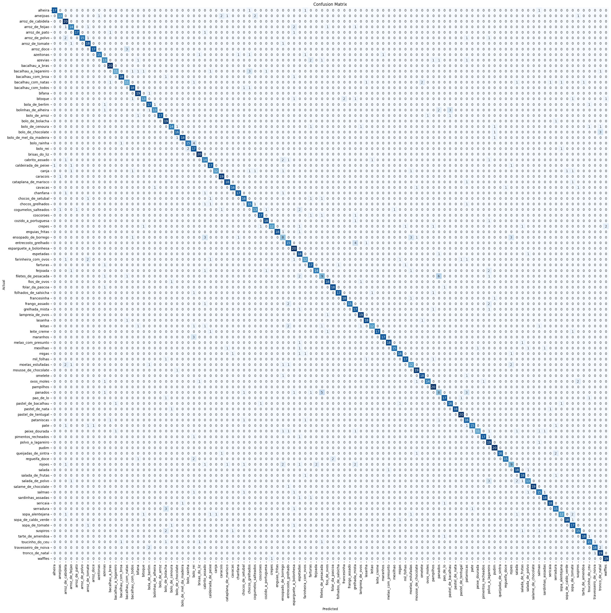
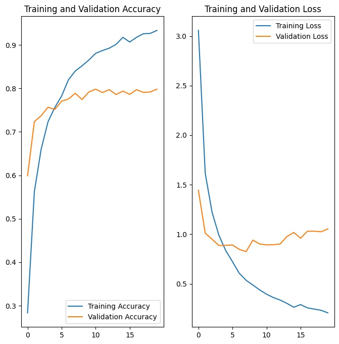

# Deep Learning com Dataset de Gastronomia Portuguesa
Este projeto utiliza um modelo de deep learning para classificar imagens de pratos tradicionais da gastronomia portuguesa. Utilizando uma arquitetura personalizada com várias camadas, exploramos técnicas avançadas de processamento de imagem e ajustamos hiperparâmetros para obter resultados significativos.

Dataset utilizado: https://github.com/RafaelRibeiro2003/Dataset-de-Comida-Portuguesa

## Resultado
O modelo alcançou uma exatidão de 80% no teste após 2360 segundos (aproximadamente 39 minutos) de treino em 25 épocas.

 Foi decidido a definir o número de estações em 25 para garantir que o modelo treinasse de forma eficiente e evitasse o sobreajuste. Foi analisado o desempenho do modelo ao longo do tempo, inicialmente treinando para 100 épocas. Foi observado que, após 25 épocas, a precisão da validação começou a diminuir, indicando que continuar treinando além desse ponto resultou em sobreajuste e não melhorou a precisão no conjunto de testes. 

## Matriz de Confusão

  

Ao observar a matriz, é possível notar que a maioria das previsões corretas está concentrada ao longo da diagonal, indicando que o modelo classifica, na maioria das vezes, corretamente os pratos. Cada célula na diagonal contém um número que representa a quantidade de amostras que foram corretamente classificadas para aquela classe específica. A densidade e intensidade da cor azul ao longo da diagonal confirmam a alta taxa de acertos do modelo.

 As células fora da diagonal representam os erros de classificação, onde o modelo previu incorretamente a classe de um prato. A presença de números baixos e cores menos intensas fora da diagonal sugere que o modelo comete poucos erros de classificação, o que é um bom indicativo de seu desempenho. 

## Gráfico de treino e validação do modelo DenseNet169
Na figura seguinte, o gráfico à esquerda apresenta a precisão e validação do treino ao longo das épocas. A linha azul representa a precisão do treino que, após um rápido crescimento inicial, continua a aumentar gradualmente, atingindo cerca de 90% no final das 20 épocas. A linha laranja, que representa a precisão da validação, estabiliza em torno de 80%, indicando que o modelo generaliza bem para dados não vistos durante o processo de treino. 

 O gráfico de perda de treino e validação, representa com a linha azul a perda de treino, que diminui consistentemente ao longo das épocas, refletindo a melhoria contínua do modelo no ajuste aos dados de treino. A linha laranja, correspondente à perda de validação, mostra também uma tendência inicial de queda, mas estabiliza após algumas épocas. 

  

